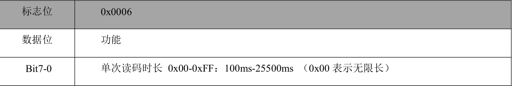
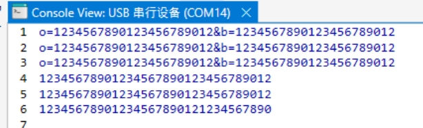

# 扫码器通讯

----

### 扫码器使用手册V1

+   建立连接
    +   插入PC后, 上位机会通过发送指令 ==AT_ReadDeviceID\r== 来判断,如果扫码器验证成功, 则回应对应的ID, 例如: ==SN:SCANNER00009;MID:SCANNER01;FID:MESEEE01.== 这里FID是不变的

+   上电
    +   上电后, 单片机初始化操作,默认手动模式(即命令触发模式), 按下黄色键即可开启扫描状态(15s), 扫描过程中状态灯会闪烁, 扫描成功或者时间到状态灯熄灭.
+   连续模式
    +   当单片机收到上位机指令 ==AT_CONTINUOURS\r== 扫码器切换为连续扫码状态, 连续扫码状态黄色常量

+   按键
    +   V1版本按键有绿色和黄色, 在不管什么状态下, 按下按键, 触发上升沿中断, 向PC发送对应指令,
        +   NOTE: 在触发中断的过程中, 在没完成发送指令前, 不对串口2开启中断, 即按下按键,使能扫描器接收中断, 待按键松开,重新使能
    +   在单次模式下, 黄色按键不起作用, 改为按下扫描, 绿色全过程中正常使用.

---


+   版本

    +   ```text
        25/3/9
        	增加返回指令的识别,当主控向扫描器发送指令,若扫描器成功接收,则返回回应指令,此更改在接收中断函数(usart2)中进行判断.
        	在中断接收函数中判断指令02 00 00 01 00 33 31, 若正确,则在函数中清除缓存,以确保后续数据的准确接收.
        	在接收中断函数,只有三种情况,数据才会被程序处理.
        	1-回应指令,前文已说明过		
        	2-当最后一个字符为'.'			// DeviceID的回应
        	3-当最后一个字符为'\r'			// 扫码数据的回应
        	
        	以及在单次扫描模式中,即手动模式,在程序上是用命令触发模式,当按下按键,扫描器开始扫描,计时指定时间,这里是15s,15s中LED会闪烁提示,到时间后或扫码成功则熄灭.用到定时器3.考虑后续要不要加此功能.
        25/4/9
        	将黄灯在连续模式下改成常量,黄灯在手动模式下在扫描状态中闪烁不变
        	将发送二维码数据格式中的"CODE_DATA:"改成"A:"
        ```
        

+   摄像头常用命令

    +   读码时长
    +   

+   **1、USB转串口CH340驱动**

    +   这个设备是CH340驱动,如果不装此驱动,电脑会识别不出来这个USB设备

+   **2、读取设备ID**

    +   读取设备ID,判定目标设备,建立连接
        +   当USB Device连接到主机后，主机发送Device指令，读取设备ID: ==AT_ReadDeviceID== （以'\r'回车符CR结束,该ASCII码对应的十六进制是0x0D), Device收到后会回对应的设备ID,格式基本如：==SN:SCANNER00009;MID:SCANNER01;FID:MESEEE01.== 
        
        +   FID信息是固定不变的
        
            ```
            SN:产品序列号
            FID:厂商信息
            MID:产品型号
            ```
        
            

+   **3、扫码数据**

    +   当扫码器扫码成功后，会向主机发送码对应的数据，如（大致的每个码的数据像一下这样，这里的每行都是一个码的数据）：
    +   以前缀"A:"开头, 以回车符'\r'结束
    +   

+   **4、切换模式**

    +   扫码器上电默认手动扫描模式，由主机端控制是否切换为连续扫描模式

    +   **切换连续扫描模式(每条指令同样是以回车符CR作为结束)**
        +   指令: ==AT_CONTINUOUS== 
        
    +   **切换手动模式**
        
        +   指令: ==AT_MANUAL==
        
    +   发送完成, 设备成功接收到会回应主机:

        +   ```
            例如: AA 11 AB 10 0D
            AA: 帧头
            11: 状态回应类型
            AB: 表示OK            (FF表示错误)
            10: 异或校验和
            0D: 表示结束
            ```

+   **5、设备发送按键值**

​                ● 当用户按下按键,设备会向PC发送指令.

​                ● 当按键按下,发送五个字节: 

​                ○ 

```
例如: AA 01 01 AA 0D
AA:为帧头
01:按键操作类型
第三个字节:按键值 (01 表示绿色按键按下,02表示黄色按键按下)
第四个字节:异或校验和
第五个字节:OD结束
```

​                ● 同样以回车符CR结束